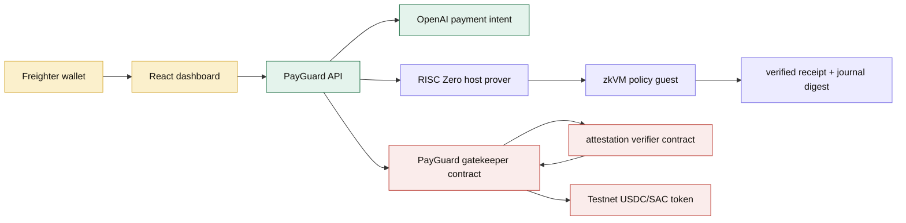

# PayGuard Agent

ZK-enforced AI agent payment policy layer on Stellar.

PayGuard Agent lets a user define private payment rules for an AI agent, register only the policy hash on Stellar, and require proof-backed policy enforcement before funds can move. The product is built for the Stellar Hacks: Real-World ZK track and is structured as a clean-room project, independent from earlier prototypes.

For the hackathon requirement, ZK is load-bearing: the RISC Zero guest proves the private policy evaluation, the API rejects prover output that does not match the canonical protocol evaluator, and the Stellar gatekeeper cannot update payment state until its configured verifier boundary succeeds.

## What Works Now

- React/Vite landing page and dashboard based on the supplied PayGuard HTML designs.
- Freighter wallet connection and Stellar testnet RPC health checks.
- Server-side OpenAI payment-intent endpoint, with a deterministic local fallback when `OPENAI_API_KEY` is not set.
- Proof job API that can run a real RISC Zero prover through `PAYGUARD_REAL_PROVER_CMD`.
- Soroban gatekeeper contract plus a Stellar-compatible attestation verifier for RISC Zero receipts.
- Testnet gatekeeper deployed with the real RISC Zero image ID generated by the WSL prover.
- `temp/` is ignored so prototype HTML files do not go to GitHub.

## Architecture



Repository map:

```text
apps/web                         React dashboard, wallet connect, policy builder, agent console
services/api                     OpenAI intent API and proof job lifecycle
packages/protocol                shared policy hashing, USDC math, validation and evaluation
contracts/payguard_gatekeeper    Soroban vault + proof-gated decision execution
contracts/payguard_attestation_verifier RISC Zero receipt attestation gate for Stellar testnet
zk/risc0                         RISC Zero guest + host prover workspace
```

## Stellar Testnet

| Component | Contract / Tx | Link |
| --- | --- | --- |
| PayGuard Gatekeeper | `CCWI7RD45NERQ4XGUEFEBQ3IFAFASKWWERC6T2BX65WP7HKIVX6DV47G` | [Stellar Expert](https://stellar.expert/explorer/testnet/contract/CCWI7RD45NERQ4XGUEFEBQ3IFAFASKWWERC6T2BX65WP7HKIVX6DV47G) |
| RISC Zero Attestation Verifier | `CBBLSXR6SI2LGQ47LGZXWTH3FCFGRH2MKIWASYCNJBK7EQP4RJRJ56ZG` | [Stellar Expert](https://stellar.expert/explorer/testnet/contract/CBBLSXR6SI2LGQ47LGZXWTH3FCFGRH2MKIWASYCNJBK7EQP4RJRJ56ZG) |
| Gatekeeper deploy tx | `3e1c50cb895e3e4fa3174cd070096ebfe84c98d6bb980fcc238c7565019b75ac` | [Stellar Expert](https://stellar.expert/explorer/testnet/tx/3e1c50cb895e3e4fa3174cd070096ebfe84c98d6bb980fcc238c7565019b75ac) |
| Verifier deploy tx | `722006ed5d16bc850c08d9d2fc8e12737a939124cd602b7ae394f5d212e23ff2` | [Stellar Expert](https://stellar.expert/explorer/testnet/tx/722006ed5d16bc850c08d9d2fc8e12737a939124cd602b7ae394f5d212e23ff2) |

RISC Zero image ID:

```text
04600792508247891dd720185555a22d28654184c312d8197b4ae8157fbe40cd
```

Verifier attester:

```text
GDS3AE253EX3ZDLSCBIGH3JCI2XGBVTI23ZP2INUOY562YJIAJM6FRQT
```

## Quick Start

```powershell
npm install
npm run build
npm run dev:api
npm run dev:web
```

Open the web app at `http://localhost:5173`.

## Environment

Copy `.env.example` to `.env` and fill:

```text
OPENAI_API_KEY=...
VITE_PAYGUARD_CONTRACT_ID=CCWI7RD45NERQ4XGUEFEBQ3IFAFASKWWERC6T2BX65WP7HKIVX6DV47G
VITE_PAYGUARD_VERIFIER_CONTRACT_ID=CBBLSXR6SI2LGQ47LGZXWTH3FCFGRH2MKIWASYCNJBK7EQP4RJRJ56ZG
VITE_PAYGUARD_TOKEN_CONTRACT_ID=...
PAYGUARD_RISC0_IMAGE_ID=04600792508247891dd720185555a22d28654184c312d8197b4ae8157fbe40cd
PAYGUARD_REAL_PROVER_CMD=scripts/prove-risc0.sh
```

Without `OPENAI_API_KEY`, the backend uses a deterministic local payment-intent fallback for demo flow. Without `PAYGUARD_REAL_PROVER_CMD`, proof jobs fall back to the deterministic development evaluator.

## ZK Boundary

RISC Zero receipts are generated and verified by `zk/risc0/host`. On Stellar testnet today, PayGuard uses the attestation pattern from the ZK skill guidance: the receipt is verified off-chain, then an authorized attester signs the verifier contract call that gates the Soroban state transition. When native BN254 verification is available on the target Stellar network, `payguard_attestation_verifier` can be replaced by a direct Groth16 verifier without changing the gatekeeper payment flow.

This repo also references the direct RISC Zero verifier path described in the hackathon resources. The current deployed verifier is intentionally isolated behind the same `verify(seal, image_id, journal_digest)` interface so the Nethermind-style Groth16 verifier can replace it without changing the payment contract.

Run the prover from your WSL shell after installing `rzup`:

```bash
source /root/.bashrc
cd "/mnt/d/Nikhil Work/STELLAR HACKATHON/PayGuard"
cd zk/risc0
cargo run --release -p payguard-risc0-prover < prover-input.example.json
cd ../..
PAYGUARD_REAL_PROVER_CMD=scripts/prove-risc0.sh npm run dev:api
```

Verified local receipt output from WSL:

```text
approved=true
violation=0
journalDigest=134c27f31af10010a2dbc583619f9050219668ff4ca0bdb3234a9b7baca20414
receiptVerified=true
mode=risc0-local-receipt
```

## License

MIT. Copyright (c) 2026 Nikhil Raikwar.
