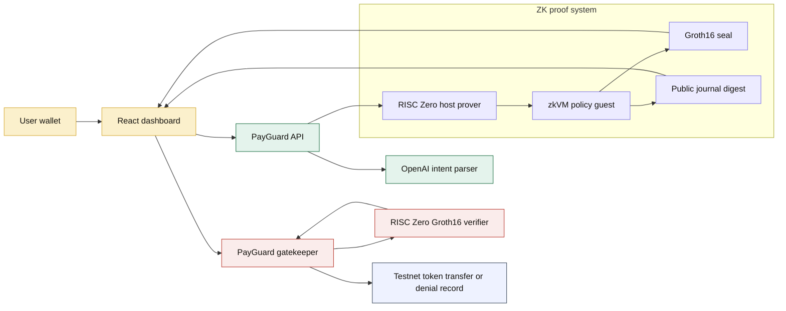
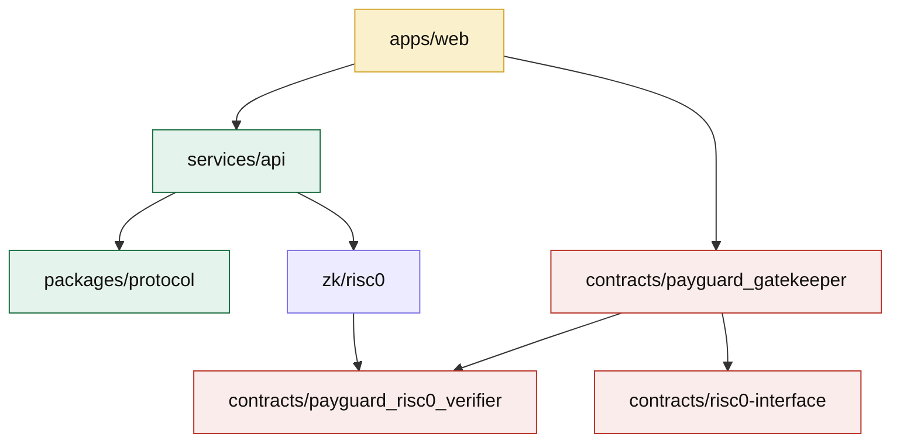

# PayGuard Agent

[](https://stellar.expert/explorer/testnet)
[](https://dev.risczero.com/)
[](https://developers.stellar.org/docs/build/smart-contracts)
[](LICENSE)

PayGuard Agent is a ZK-enforced payment layer for AI agents on Stellar. A user defines private payment rules, stores only a policy hash on Stellar, and requires a RISC Zero Groth16 proof before the gatekeeper contract can approve a payment or record a denial.

The hackathon build uses real Stellar testnet contracts and a real RISC Zero Groth16 prover/verifier path.

## What It Does

- Connect a Stellar testnet wallet through the dashboard.
- Create a private payment policy with a max payment amount, daily budget, recipient allowlist, expiry, and salt.
- Ask an OpenAI-powered agent to turn a natural-language task into a structured payment intent.
- Prove the private policy decision inside a RISC Zero zkVM guest.
- Submit the Groth16 proof payload to the PayGuard gatekeeper.
- Let the Soroban gatekeeper call the deployed RISC Zero Groth16 verifier before moving funds or recording a blocked payment.

## Why ZK Is Load-Bearing

1. The private policy values are never posted on-chain.
2. The RISC Zero guest proves that the payment intent was evaluated against those private values.
3. The Soroban gatekeeper recomputes the same public journal digest and calls the verifier before any state transition.
4. A wrong proof, image ID, journal digest, policy nonce, executor, or network context prevents execution.

## Proof Flow



## Component Map



## Privacy Boundary

| Data | Where it lives | Public? |
| --- | --- | --- |
| Max payment, daily limit, allowlist, expiry, salt | User/API prover input | No |
| Policy hash | Gatekeeper contract state | Yes |
| Payment intent digest | Proof payload and journal binding | Yes |
| RISC Zero image ID | Env and gatekeeper config | Yes |
| Groth16 seal | Wallet-submitted contract call | Yes |
| Approved or denied result | Gatekeeper state/event | Yes |

## Stellar Testnet Deployment

| Component | ID / transaction | Link |
| --- | --- | --- |
| PayGuard Gatekeeper | `CDKNJSCK3DUCBJBTEFIYCGNZINAEKFBR24WNUVHCLCPUZJEBHDGLQCUK` | [Stellar Expert](https://stellar.expert/explorer/testnet/contract/CDKNJSCK3DUCBJBTEFIYCGNZINAEKFBR24WNUVHCLCPUZJEBHDGLQCUK) |
| RISC Zero Groth16 Verifier | `CAHYIV4H2AWIXW5OQZO5EK4VOKLROLNGMB3AGJBR46XC63JKB3VM5CO5` | [Stellar Expert](https://stellar.expert/explorer/testnet/contract/CAHYIV4H2AWIXW5OQZO5EK4VOKLROLNGMB3AGJBR46XC63JKB3VM5CO5) |
| Gatekeeper deploy tx | `4d01e0f970feddea871e0e296f481e42b0f732679c71ef4888aab2aa60bfe32c` | [Stellar Expert](https://stellar.expert/explorer/testnet/tx/4d01e0f970feddea871e0e296f481e42b0f732679c71ef4888aab2aa60bfe32c) |
| Verifier deploy tx | `2dbb911ec30bc4d7e6a611ea91b4e5d325af46a6558f6efda2910a356df3e57d` | [Stellar Expert](https://stellar.expert/explorer/testnet/tx/2dbb911ec30bc4d7e6a611ea91b4e5d325af46a6558f6efda2910a356df3e57d) |

RISC Zero image ID:

```text
b0c26f9bf9a887389b8004d1f105529641b10140ad42ed0cbfb6fcb7ee51e461
```

RISC Zero Groth16 seal selector:

```text
73c457ba
```

## Technical ZK Boundary

The host prover in `zk/risc0/host` runs the PayGuard guest with `ProverOpts::groth16()` and encodes the proof with `risc0-ethereum-contracts::encode_seal`.

The public RISC Zero journal is exactly the 32-byte PayGuard gatekeeper decision digest. The gatekeeper recomputes that digest from the submitted Soroban journal, hashes it into the RISC Zero receipt journal digest, and calls:

```text
verify(seal, image_id, sha256(gatekeeper_journal_digest_bytes))
```

The verifier contract checks the Groth16 proof against the configured RISC Zero verifier parameters. The gatekeeper then checks policy ID, executor, nonce, recipient, amount, approval flag, and journal binding before updating state.

## Project Structure

```text
apps/web                         React dashboard, wallet connection, policy builder, agent console
services/api                     OpenAI intent API and proof job lifecycle
packages/protocol                Shared policy hashing, validation, USDC math, decision digest
contracts/payguard_gatekeeper    Soroban vault and proof-gated execution contract
contracts/payguard_risc0_verifier RISC Zero Groth16 verifier using Stellar BN254 host functions
contracts/risc0-interface         Shared verifier client interface
zk/risc0                         RISC Zero guest and host prover workspace
scripts                          Prover and deployment entrypoints
deployments                      Testnet deployment metadata
```

## Environment

Copy `.env.example` to `.env` for local development. Required frontend variables:

```text
VITE_PAYGUARD_API_URL=http://localhost:8787
VITE_STELLAR_NETWORK=testnet
VITE_STELLAR_RPC_URL=https://soroban-testnet.stellar.org
VITE_PAYGUARD_CONTRACT_ID=CDKNJSCK3DUCBJBTEFIYCGNZINAEKFBR24WNUVHCLCPUZJEBHDGLQCUK
VITE_PAYGUARD_VERIFIER_CONTRACT_ID=CAHYIV4H2AWIXW5OQZO5EK4VOKLROLNGMB3AGJBR46XC63JKB3VM5CO5
VITE_PAYGUARD_RISC0_IMAGE_ID=b0c26f9bf9a887389b8004d1f105529641b10140ad42ed0cbfb6fcb7ee51e461
```

Required API/prover variables:

```text
OPENAI_API_KEY=
OPENAI_MODEL=gpt-4.1-mini
PAYGUARD_CONTRACT_ID=CDKNJSCK3DUCBJBTEFIYCGNZINAEKFBR24WNUVHCLCPUZJEBHDGLQCUK
PAYGUARD_VERIFIER_CONTRACT_ID=CAHYIV4H2AWIXW5OQZO5EK4VOKLROLNGMB3AGJBR46XC63JKB3VM5CO5
PAYGUARD_RISC0_IMAGE_ID=b0c26f9bf9a887389b8004d1f105529641b10140ad42ed0cbfb6fcb7ee51e461
PAYGUARD_VERIFIER_MODE=risc0-groth16-onchain
PAYGUARD_REAL_PROVER_CMD=scripts/prove-risc0-groth16.sh
```

## Local Development

```powershell
npm install
npm run dev:api
npm run dev:web
```

Open the app at `http://localhost:5173`. The API root path is intentionally not a page; use `/v1/health` and `/v1/config` for backend checks.

## License

MIT. Copyright (c) 2026 Nikhil Raikwar.
