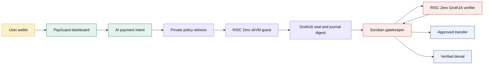
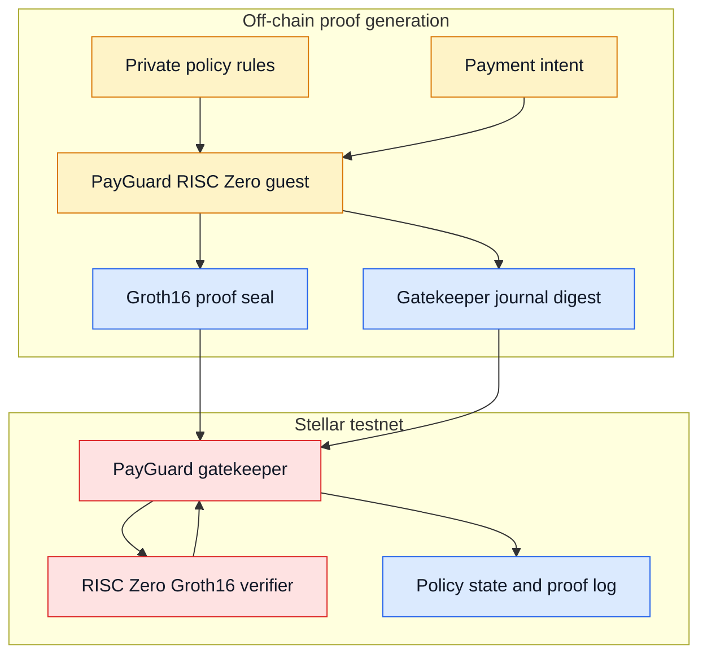

# PayGuard Agent

## ZK-Enforced AI Agent Payments on Stellar

AI agents can propose payments. PayGuard makes them prove policy compliance before funds can move.

PayGuard Agent is a privacy-preserving payment control layer for AI agents on Stellar. A user defines private spending rules, registers only a policy hash on Stellar, and requires a RISC Zero Groth16 proof before the Soroban gatekeeper contract can approve a payment or record a denial.

## Submission Summary

| Field | Details |
| --- | --- |
| Hackathon | Stellar Hacks: Real-World ZK |
| Track fit | Real ZK on Stellar, agentic payments, Soroban smart contracts |
| Chain | Stellar testnet |
| ZK system | RISC Zero zkVM, Groth16 proof, BN254 verifier |
| Smart contracts | PayGuard gatekeeper and RISC Zero Groth16 verifier |
| Backend | Hugging Face Spaces Docker API |
| Frontend | React/Vite dashboard |
| Wallet | Freighter and Stellar Wallets Kit |

## Live Links

- GitHub: `https://github.com/NikhilRaikwar/PayGuard`
- Hugging Face API Space: `https://huggingface.co/spaces/NikhilRaikwar/payguard-api`
- API health: `https://nikhilraikwar-payguard-api.hf.space/v1/health`
- API config: `https://nikhilraikwar-payguard-api.hf.space/v1/config`
- Gatekeeper contract: `CDKNJSCK3DUCBJBTEFIYCGNZINAEKFBR24WNUVHCLCPUZJEBHDGLQCUK`
- RISC Zero verifier contract: `CAHYIV4H2AWIXW5OQZO5EK4VOKLROLNGMB3AGJBR46XC63JKB3VM5CO5`

## What It Does

PayGuard lets a user create a private payment policy for an AI agent:

- Maximum amount per payment
- Daily spending limit
- Recipient allowlist
- Policy expiry
- Private salt for policy commitment

The AI agent can parse a natural language payment request, but it cannot authorize payment by itself. The payment is turned into a structured intent, evaluated inside the RISC Zero guest, and bound to a Soroban journal. The gatekeeper contract verifies the proof boundary before recording approval, denial, spend, nonce, and vault balance changes.

## Why This Is Real ZK

ZK is not decorative in PayGuard. It is the authorization gate.

1. Private rules are kept off-chain.
2. The RISC Zero guest evaluates the payment against those private rules.
3. The public journal binds the policy, payment, nonce, network, executor, and result.
4. The Soroban gatekeeper calls the RISC Zero Groth16 verifier before any state transition.
5. Invalid proof, wrong image ID, wrong journal digest, wrong nonce, or wrong executor means no payment execution.

## System Flow



## On-Chain Verification Boundary



## What Judges Should Check

| Check | Where |
| --- | --- |
| ZK verifier contract is live | Stellar Expert verifier contract link |
| Gatekeeper uses verifier boundary | `contracts/payguard_gatekeeper/src/lib.rs` |
| RISC Zero guest evaluates policy | `zk/risc0/methods/guest/src/main.rs` |
| Host creates Groth16 payload | `zk/risc0/host/src/main.rs` |
| API calls real prover boundary | `services/api/src/server.ts` |
| UI submits wallet-signed execution | `apps/web/src/App.tsx` |

## Deployed Stellar Testnet Contracts

| Component | ID / transaction | Link |
| --- | --- | --- |
| PayGuard Gatekeeper | `CDKNJSCK3DUCBJBTEFIYCGNZINAEKFBR24WNUVHCLCPUZJEBHDGLQCUK` | `https://stellar.expert/explorer/testnet/contract/CDKNJSCK3DUCBJBTEFIYCGNZINAEKFBR24WNUVHCLCPUZJEBHDGLQCUK` |
| RISC Zero Groth16 Verifier | `CAHYIV4H2AWIXW5OQZO5EK4VOKLROLNGMB3AGJBR46XC63JKB3VM5CO5` | `https://stellar.expert/explorer/testnet/contract/CAHYIV4H2AWIXW5OQZO5EK4VOKLROLNGMB3AGJBR46XC63JKB3VM5CO5` |
| Gatekeeper deploy tx | `4d01e0f970feddea871e0e296f481e42b0f732679c71ef4888aab2aa60bfe32c` | `https://stellar.expert/explorer/testnet/tx/4d01e0f970feddea871e0e296f481e42b0f732679c71ef4888aab2aa60bfe32c` |
| Verifier deploy tx | `2dbb911ec30bc4d7e6a611ea91b4e5d325af46a6558f6efda2910a356df3e57d` | `https://stellar.expert/explorer/testnet/tx/2dbb911ec30bc4d7e6a611ea91b4e5d325af46a6558f6efda2910a356df3e57d` |

RISC Zero image ID:

```text
b0c26f9bf9a887389b8004d1f105529641b10140ad42ed0cbfb6fcb7ee51e461
```

RISC Zero Groth16 selector:

```text
73c457ba
```

## Privacy Boundary

| Private | Public |
| --- | --- |
| Max payment amount | Policy hash |
| Daily spend limit | Contract IDs |
| Recipient allowlist | RISC Zero image ID |
| Policy salt | Proof seal |
| Full policy witness | Journal digest |
| User intent details before proving | Approved or denied decision event |

## Demo Path for Judges

1. Open the dashboard.
2. Connect a Stellar testnet wallet.
3. Create a policy with a max amount, daily budget, allowlist, expiry, and vault amount.
4. Ask the agent to pay an allowlisted recipient under the max amount.
5. Generate the proof and submit the wallet transaction.
6. Try an over-limit or unlisted recipient.
7. Confirm the blocked decision is recorded instead of moving funds.

## Why It Matters

Autonomous agents need payment limits, but simple server-side checks are not enough. PayGuard gives teams a way to delegate routine payments while keeping policy values private and making enforcement verifiable on Stellar.

The result is a practical Real-World ZK product: private policy evaluation off-chain, public verifier enforcement on-chain, and an agent payment flow that fails closed when proof is missing or invalid.

## Built With

- Stellar testnet and Soroban smart contracts
- RISC Zero zkVM and Groth16 receipts
- Nethermind-style Stellar RISC Zero verifier pattern
- React, Vite, TypeScript
- Node.js and Express
- Hugging Face Spaces Docker backend
- Freighter and Stellar Wallets Kit
- OpenAI intent parsing

## Hackathon Fit

PayGuard directly targets the Real-World ZK prompt: it turns Stellar's ZK primitives into a finished agentic payments product. The proof is not an optional badge. It is the line between a proposed payment and an executable payment.
